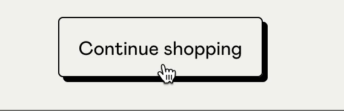

# Prova USF-08 Basi di sviluppo front-end del 25/06/2024

Il compito consiste nella realizzazione di una homepage tramite HTML, CSS e Javascript di una mostra su opere d'arte _feline_: Feline Artworks Exhibition.

## Design

Avete a disposizione il design della pagina in formato desktop, che trovare nella cartella `design`

- design-desktop.png

### Font

Il font da utilizzare è: [Syne](https://fonts.google.com/specimen/Syne)
Il font del titolo principale è: [Sarina](https://fonts.google.com/specimen/Sarina)

Pesi da utilizzare:

- 400
- 500
- 600

### Palette colori

- #FFFFFF (white)
- #000000 (black)
- #545454 (neutral-black)
- #FFEDC0 (sfondo)

## Informazioni e immagini delle opere d'arte

Dovrete recuperare le informazioni delle opere d'arte chiamando l'API apposita:

```js
fetch(`https://api.artic.edu/api/v1/artworks/${idArtwork}`)
```

Le informazioni da recuperare sono:

- immagine dell'opera d'arte (`image_id` vedi sezione apposita URL img opere d'arte)
- nome dell'opera d'arte (`title`)
- nome dell'artista (`artist_title`)

Gli ID delle opere d'arte di cui recuperare le informazioni sono:

- 14006 (gatto sull'albero)
- 51719
- 16858
- 13914

## URL img opere d'arte

Dalla API sulla singola opera d'arte recuperate `image_id` che vi permetterà di comporre l'indirizzo dell'immagine dell'opera d'arte.

Di seguito un esempio:

```html
<!-- Esempio di url di una immagine di un'opera d'arte -->
<!-- 63f49f6d-020e-1d54-d11d-ed027d5e1bd8 è l'image_id -->

```

**Nota Bene**

Potete modificare la dimensione dell'immagine dalla chiamata API (la size è l'unico parametro che vi interessa):

_Composizione dell'URL di una immagine_

```
https://www.artic.edu/iiif/2/{identifier}/{region}/{size}/{rotation}/{quality}.{format}
```

#### Documentazione API

- [Per le immagini delle opere d'arte](https://api.artic.edu/docs/#iiif-image-api)
- [Documentazione della API delle opere d'arte](https://api.artic.edu/docs/#quick-start)

**Tip**
Per le immagini sfruttate la proprietà CSS `object-fit` in modo da poter otterere le proporzioni corrette.

### Button Find out more

Il tasto `Find out more` al click deve aprire un alert contenente questo messaggio:
"Become a Member today or purchase the perfect gift for someone special. The offer is valid until <DATA_DI_OGGI + 10 GIORNI>"

La data di scadenza della offerta devi quindi essere calcolato tramite Javascript prendendo la data di oggi e aggiungendo 10 giorni.
Formattare in formato italiano la data (usa il costruttore Intl).

## Bonus nella realizzazione

- Applicare nelle prime tre immagini una animazione al momento dell'hover del cursore sulla stessa, creando (potete vedere un esempio nella terza immagine del design fornitovi) un'ombra solida.

Un esempio:



```

```
